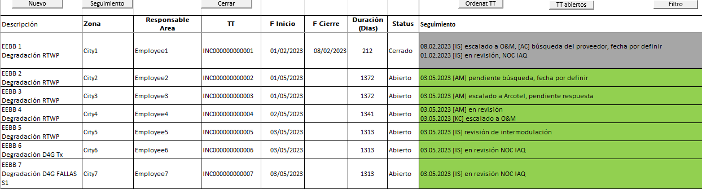
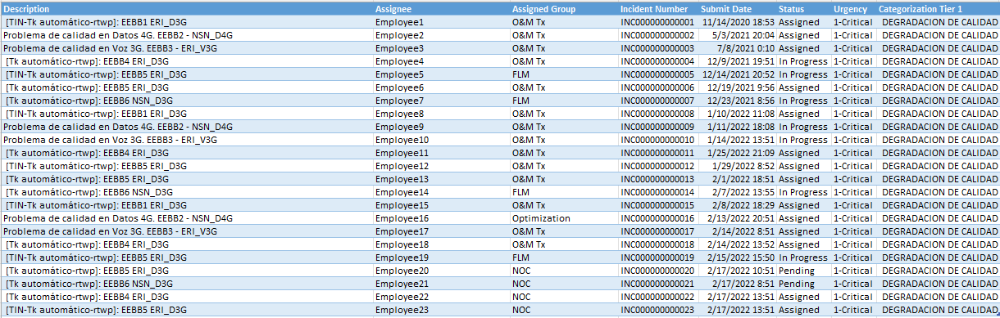

# Excel VBA Quality Meeting Tracker

Keeps the log of network quality degradations reviewed in the quality follow-up meeting. Each case is opened, updated and closed through small forms, so every entry has the same structure, and the open critical trouble tickets are based from the ticketing database.

## What it does

- Keeps one row per degradation: base station and affected service, zone, responsible area, trouble ticket, start date, close date, duration and status
- Opens, updates and closes cases with one button each, instead of typing and formatting cells by hand
- Stamps every follow-up comment with the date and the initials of the responsible person, so the history of a case reads from top to bottom
- Calculates the duration of each case automatically: days elapsed so far while it is open, total days once it is closed
- Uses color to show the state at a glance: green for cases with a recent follow-up, grey for closed ones
- Queries the ticketing database (BMC Remedy, through ODBC) for the critical quality-degradation tickets that are still assigned, in progress or pending

## The buttons

- **Nuevo** (new): opens a form that asks for the base station, the affected services and the city, status *Abierto* and its first follow-up entry. If the case is escalated to the NOC, a checkbox writes the standard escalation comment with the initials of the person escalating.
- **Seguimiento** (follow-up): asks for the user's initials, adds a new dated line above the previous comments of the selected case and leaves the cell ready to type.
- **Cerrar** (close): asks for the user's initials, writes the close date, changes the status to *Cerrado*, greys the case and adds the closing comment.
- **Ordenar TT** (sort): sorts the log by trouble ticket number and extends the duration formula to every row.
- **TT abiertos** (open tickets): filters the open cases with their ticket numbers.
- **Filtro** (filter): turns the filter on the header row on and off.

Closing any form with the X cancels the action and leaves the log untouched. Text typed in the forms is converted to upper case, so entries stay uniform.

## Trouble ticket data

The `TTs data` sheet holds the result of the query in `queries/tts-data.txt`: description, assignee, assigned group, incident number, submit date, status, urgency and category of every open critical ticket for quality degradation. It is used to check the log against the ticketing system during the meeting.

## Tools

Excel, VBA (macros and UserForms), SQL through ODBC to BMC Remedy AR System

## Files

- `quality-meeting-tracker.xlsm`: the workbook
- `vba/`: exported VBA modules and forms
- `queries/`: connection string and SQL behind the `TTs data` sheet
- `images/`: screenshots

## How to try it

The workbook opens with sample data already loaded, so the buttons and forms can be tried without a database. Refreshing the trouble ticket query requires Excel for Windows, the AR System ODBC driver and your own connection details.

## Data

All base stations, cities, employees and ticket numbers are anonymized. Connection details are placeholders.
